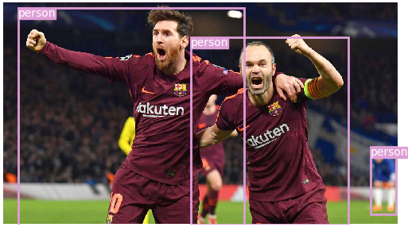

# YOLO-V3 Implementation using PyTorch

This is just a re implementation of Yolo v3 object detection algorithm using darknet using PyTorch. There was already many codes available in the market for yolo-v3 in keras/tensorflow but, when I was doing my thesis I wanted to implement it in PyTorch.

COCO weight files were used to train the model, which is having 80 object classes. But, I trained only for person class, which I am further developed for pose estimation using transfer learning using the resulted weight file.
 

<p align="center"></p>


### Note:
+ This Repository is still in developing mode.
+ Requirements.txt, hardware requirements and my exact results everything will be updates soon. As I have implemented in my University lab.

### Usage:
Training:
+ yolov3_person_det is used to train the model
```python
        python ./yolo_Person_det/yolov3_person_det.py
```
### References: